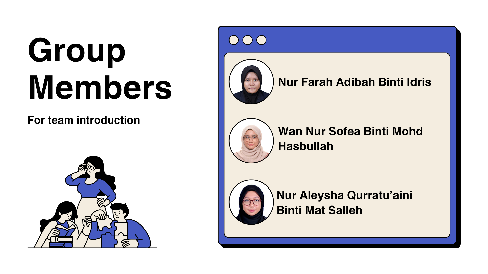
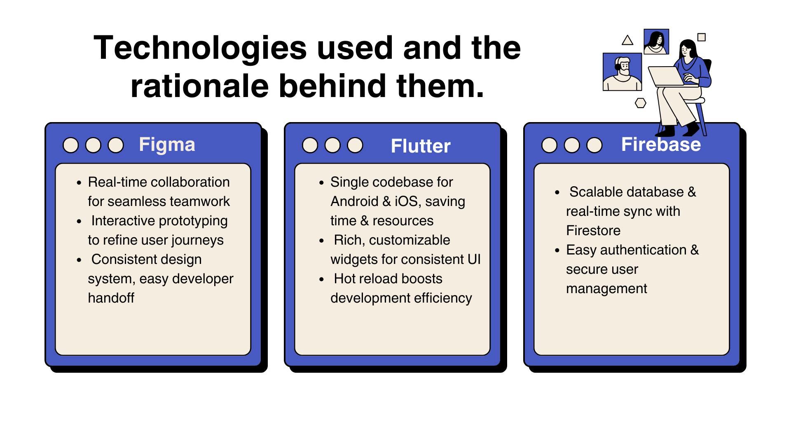
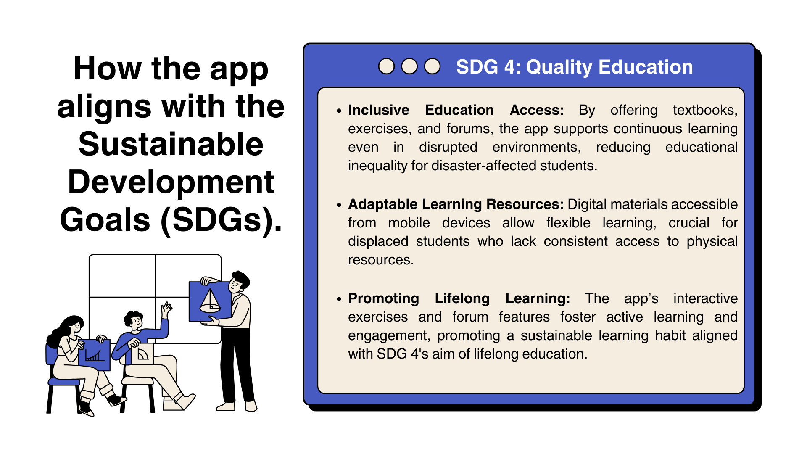
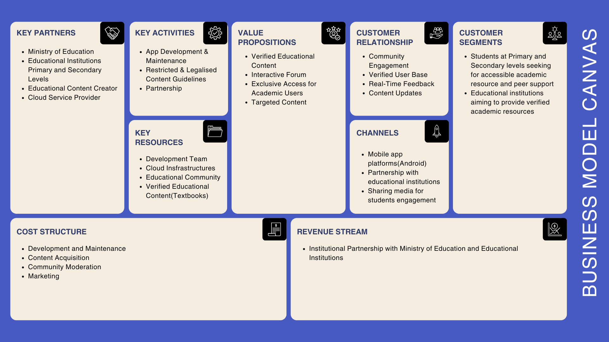

# JaminBelaja
Our app provides essential educational resources and interactive support for students affected by natural disasters. Through its online textbook library, students can easily access subject-specific content across various topics, enabling them to continue their studies without disruption. In addition, the app offers a ‘Post & Answer’ section, which functions as a community-driven Q&A platform where users can ask questions, share insights, and receive support from peers—much like Reddit. Finally, each subject includes dedicated exercise sections, allowing students to reinforce their knowledge and track their progress effectively. By combining accessible educational materials, community engagement, and practice exercises, our platform aims to offer a comprehensive learning solution that addresses both academic needs and peer interaction.

## Table of Contents
- [Setup](#setup)
- [Dependencies](#dependencies)
- [Usage](#usage)
- [Presentation](#presentation)

## Setup

To run this app locally, follow these steps:

1. Clone the repository:
   ```bash
   git clone https://github.com/wannursofea/Data-Pioneeers.git
   cd Data-Pioneeers/jamin_belaja
2. Ensure Flutter is Installed: If you don't have Flutter installed, follow the official installation guide.
3. Get the Dependencies:
   ```bash
   flutter pub get
4. Run the App:
   ```bash
   flutter run
  
Alternatively, you can download the APK file from the following location: 
[JaminBelaja.apk](https://github.com/wannursofea/Data-Pioneeers/blob/main/jamin_belaja_apk/app-release.apk)
## Dependencies
This app requires the following dependencies:
- flutter
- firebase_auth
- cloud_firestore
- provider
- firebase_core
- flutter_spinkit

## Usage
Once the app is running, you can:
- Navigate through the online textbook library to access materials.
- Participate in the Q&A section to ask or answer questions.
- Use the exercise sections to reinforce learning experience
  
## Presentation







